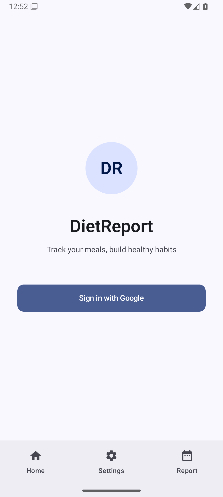
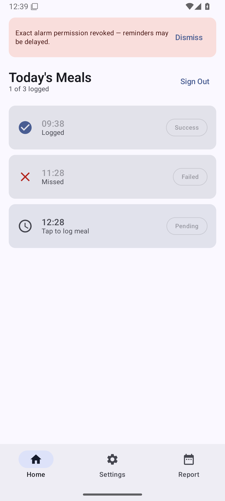
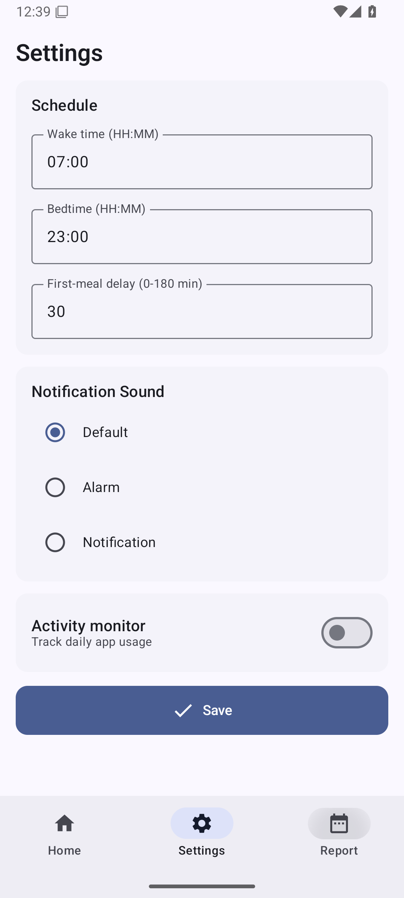
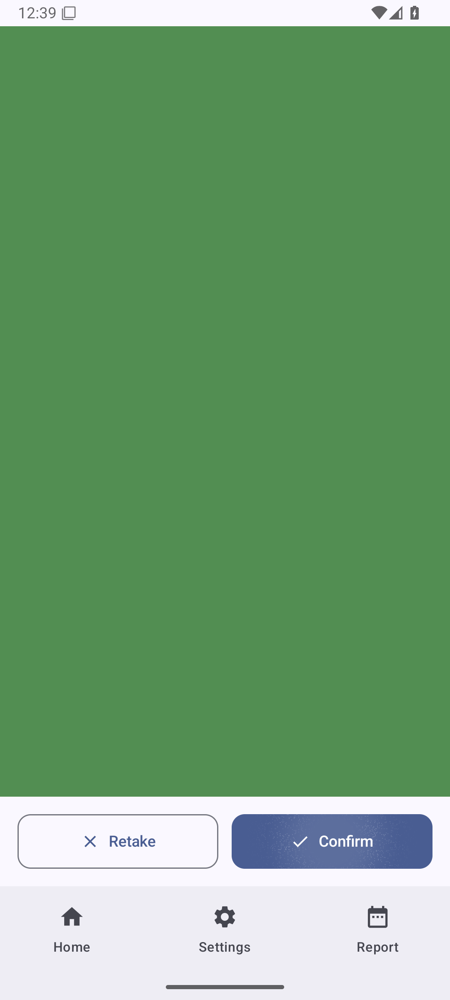
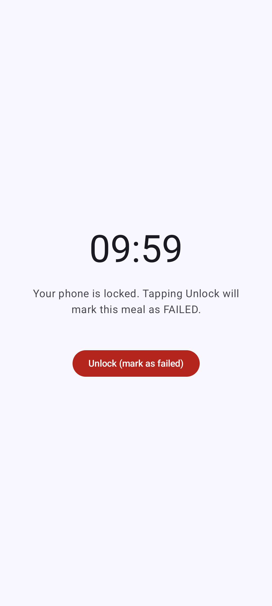
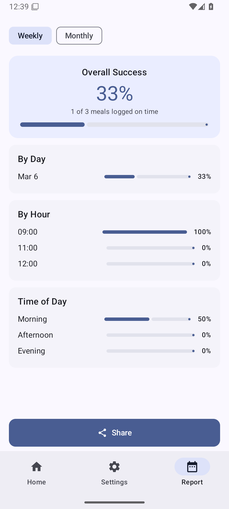

# DietReport — Meal Tracking App

An Android app that helps you track meal logging consistency. It sends periodic reminders throughout your waking hours, prompts you to photograph each meal within a 30-minute window, and generates weekly/monthly success-rate reports.

## Features

- Google Sign-In authentication
- Configurable waking hours, bedtime, and first-meal delay
- Automatic reminders every 3 hours (stops 2 hours before bedtime)
- 30-minute logging window per reminder (camera or gallery)
- Post-log phone lock screen (10-minute focus period)
- Weekly and monthly success-rate reports with sharing support
- Fully offline — no backend or cloud sync required

---

## Requirements

- Android device running **Android 15 (API 35) or higher**
- A computer with **Android Studio** or the **Android SDK platform-tools** installed
- A USB cable
- A Google account (for sign-in)

---

## Installing via USB (Sideload Debug APK)

### Step 1 — Enable Developer Options on your phone

1. Open **Settings** on your Android device.
2. Scroll down to **About phone** (or **About device**).
3. Tap **Build number** **7 times** in a row until you see "You are now a developer!".
4. Go back to **Settings** → **System** → **Developer options** (location varies by manufacturer).
5. Enable **USB debugging**.

### Step 2 — Connect your phone to the computer

1. Plug your phone into the computer with a USB cable.
2. On your phone, when prompted "Allow USB debugging?", tap **Allow** (check "Always allow from this computer" to avoid future prompts).

### Step 3 — Verify the connection

Open a terminal and run:

```bash
adb devices
```

You should see output like:

```
List of devices attached
XXXXXXXX    device
```

If the device shows as `unauthorized`, re-check the USB debugging prompt on your phone.

> **Where is `adb`?**
> - If you have Android Studio: `~/Android/Sdk/platform-tools/adb`
> - If you installed platform-tools separately, use wherever you installed it.
> - On Linux/macOS you can add it to your PATH:
>   ```bash
>   export PATH="$HOME/Android/Sdk/platform-tools:$PATH"
>   ```

### Step 4 — Build the APK

From the project root directory:

```bash
./gradlew assembleDebug
```

The APK will be generated at:

```
app/build/outputs/apk/debug/app-debug.apk
```

### Step 5 — Install the APK on your device

```bash
adb install app/build/outputs/apk/debug/app-debug.apk
```

Successful output:

```
Performing Streamed Install
Success
```

If you are **reinstalling** over an existing version:

```bash
adb install -r app/build/outputs/apk/debug/app-debug.apk
```

### Step 6 — Launch the app

The app will appear in your launcher as **DietReport**. You can also launch it directly from the terminal:

```bash
adb shell am start -n com.diet.dietreport/.MainActivity
```

---

## First-Time Setup

1. **Sign in** with your Google account.
2. On first launch you will be taken to the **Settings screen** (onboarding).
3. Set your **wake time**, **bedtime**, and **first-meal delay**.
4. Select a **ringtone**.
5. Tap **Save** — reminders will be scheduled automatically.

### Permissions required at runtime

| Permission | When prompted |
|---|---|
| Post notifications | On first Settings save |
| Schedule exact alarms | On first Settings save |
| Camera | When opening the meal-log camera |
| Read media images | When picking from gallery |

Grant all permissions when prompted. If you deny exact alarms, a warning banner will appear on the Home screen and reminders may be delayed by the system.

---

## User Manual

### Sign-In Screen



The first screen you see on every fresh install or after signing out. It shows the app logo, tagline, and a single **Sign in with Google** button.

- Tap **Sign in with Google** — a Google account picker appears.
- Select your account and grant the requested permissions.
- On your very first sign-in you are taken directly to **Settings** to complete onboarding. On subsequent sign-ins you go straight to **Home**.

The three tabs at the bottom (**Home**, **Settings**, **Report**) are always visible for navigation once you are signed in.

---

### Home Screen



The main dashboard. It shows **today's reminder slots** and their status in real time.

**Header:**
- **Today's Meals** — the date is implied; the subtitle (e.g. "1 of 3 logged") updates live as you log meals.
- **Sign Out** button — top right; clears your account and returns to the Sign-In screen.

**Slot cards:** each card represents one scheduled reminder for the day.

| Icon | Status chip | Meaning |
|---|---|---|
| Green checkmark | **Success** | Meal photo logged within the 30-minute window |
| Red X | **Failed** | Window expired or meal was not logged in time |
| Clock | **Pending** | Window is open — tap the card to log a meal now |

- Tap any **Pending** card to open the Meal Logging screen for that slot.
- Slots with **Success** or **Failed** status are read-only.

**Warning banner:** if the exact-alarm permission was revoked, a yellow banner appears at the top. Tap **Dismiss** to hide it. Re-granting the permission (Settings → Apps → DietReport → Permissions) restores full alarm precision.

---

### Settings Screen



Configure your daily schedule. Reached via the **Settings** tab in the bottom navigation bar.

**Schedule section:**

| Field | Description |
|---|---|
| Wake time (HH:MM) | The time you typically wake up. First reminder fires this many minutes after wake time, offset by the first-meal delay. |
| Bedtime (HH:MM) | Reminders stop 2 hours before this time. |
| First-meal delay (0–180 min) | How long after waking before the first reminder fires (e.g. 30 = first reminder 30 min after wake time). |

Enter times in **HH:MM** format (e.g. `07:00`, `23:00`). The app validates that wake time is before bedtime and that the delay is between 0 and 180 minutes — an error message appears inline if a value is invalid.

**Notification Sound section:** choose the ringtone that plays when a reminder fires.

| Option | Sound |
|---|---|
| Default | System default notification tone |
| Alarm | Louder alarm-style tone |
| Notification | Soft notification chime |

**Activity monitor toggle:** when enabled, the app reads your daily phone-usage patterns to automatically infer wake and bedtime, overriding the manual fields above. Requires the **Usage Access** permission, which you must grant in System Settings → Privacy → Usage Access.

**Save button:** tap to validate and persist all values. A green confirmation card appears briefly at the bottom on success. Changes take effect immediately — the reminder schedule is rebuilt for the rest of the day.

---

### Meal Logging Screen



Opened by tapping a **Pending** slot on the Home screen, or by tapping **Log meal** in the reminder notification.

**States:**

1. **No camera permission** — shows a "Grant Camera Permission" button and a "Pick from Gallery" button.
2. **Camera live view** — CameraX preview fills the screen. Two buttons appear at the bottom:
   - **Gallery** — opens the system image picker; pick an existing photo.
   - **Capture** — takes a photo with the rear camera.
3. **Photo preview** (shown in the screenshot above) — the captured or selected image fills the screen. Two buttons appear:
   - **Retake** — discards the photo and returns to the camera view.
   - **Confirm** — saves the meal log to the database and navigates to the Lock screen.

**Timing rule:** the log is marked **Success** if you tap Confirm within 30 minutes of the scheduled reminder time. After 30 minutes it is marked **Failed** regardless.

---

### Lock Screen



Appears immediately after tapping **Confirm** on the Meal Logging screen. The app enters fullscreen immersive mode and keeps the screen on for the entire countdown.

**Countdown timer:** counts down from **10:00** (ten minutes). When the timer reaches zero the lock period ends automatically, the meal stays marked **Success**, and the app navigates back to the Home screen.

**"Unlock (mark as failed)" button:** the only interactive element. Tapping it — or pressing the system Back button — cancels the countdown and **marks the meal as Failed**. Use this only if you genuinely need to use your phone.

**Backgrounding the app** (pressing Home, switching to another app, or pulling down the notification shade) has the same effect as tapping Unlock: the meal is marked Failed and the lock ends. This is intentional — the purpose of the lock screen is to encourage a phone-free focus period after eating.

---

### Report Screen



View your meal-logging statistics. Reached via the **Report** tab in the bottom navigation bar.

**Period selector:** toggle between **Weekly** (last 7 days) and **Monthly** (last 30 days).

**Overall Success card:** shows your success percentage and a progress bar. A meal counts as a success only if it was logged within the 30-minute window.

**By Day:** a list of each day in the selected period with its individual success percentage and a mini progress bar.

**By Hour:** success rate broken down by the hour each reminder was scheduled (e.g. 09:00, 12:00, 15:00). Useful for spotting which time of day you tend to miss.

**Time of Day:** three buckets — **Morning** (before 12:00), **Afternoon** (12:00–17:00), and **Evening** (after 17:00) — each with their aggregate success rate.

**Share button:** generates a plain-text summary of the current report (overall %, date range, top stats) and opens the Android Sharesheet so you can send it via WhatsApp, email, or any other app.

---

### Reminder Notifications

When a reminder fires you will receive a high-priority notification with two actions:

- **Log meal** — deep-links directly into the Meal Logging screen for that reminder slot, pre-populated with the correct slot ID.
- **Snooze** — reschedules the reminder for 10 minutes later.

The notification also plays the ringtone you selected in Settings. Make sure the app's notification channel is not silenced in your system notification settings.

---

### Tips

- **Grant exact alarms.** The app asks for the `SCHEDULE_EXACT_ALARM` permission on first save. If you deny it, reminders may be delayed by several minutes due to Android's battery optimization. Grant it in Settings → Apps → DietReport → Permissions → Alarms & reminders.
- **Do not clear app data** between sessions — this erases your meal history and settings.
- **Reboot safety.** The reminder schedule is automatically restored after a device reboot via a background receiver.
- **Gallery logging.** If you already photographed your meal with the regular camera app, tap **Gallery** on the Meal Logging screen to select the existing photo instead of retaking it.

---

## Troubleshooting

### `adb: command not found`

Add the platform-tools directory to your PATH (see Step 3 above).

### Device not listed by `adb devices`

- Try a different USB cable (data cable, not charge-only).
- Try a different USB port.
- Re-enable USB debugging on the device.
- On some phones, change the USB mode from "Charging only" to "File Transfer" or "MTP" in the notification shade.

### `INSTALL_FAILED_UPDATE_INCOMPATIBLE`

Uninstall the existing version first:

```bash
adb uninstall com.diet.dietreport
```

Then install again.

### `INSTALL_FAILED_OLDER_SDK`

Your device is running Android older than 15 (API 35). The app requires Android 15 or higher.

### App crashes immediately after install

Run the following to see the crash log:

```bash
adb logcat -s "DR/*" AndroidRuntime
```

---

## Build Commands Reference

```bash
# Build debug APK
./gradlew assembleDebug

# Build release APK (requires keystore.properties — see keystore.properties.example)
./gradlew assembleRelease

# Install directly to connected device (build + install in one step)
./gradlew installDebug

# Run unit tests
./gradlew test

# Run instrumented tests (requires connected device or emulator)
./gradlew connectedAndroidTest

# Clean build artifacts
./gradlew clean
```

---

## Project Structure

```
com.diet.dietreport/
├── MainActivity.kt
├── ui/theme/          — Material 3 theme (Color, Type, Theme)
├── auth/              — Google Sign-In, AuthViewModel
├── settings/          — SettingsScreen, SettingsViewModel, DataStore
├── reminders/         — AlarmManager scheduling, BroadcastReceivers
├── meals/             — HomeScreen, LogMealScreen, ViewModels
├── reports/           — ReportScreen, ReportViewModel
├── lock/              — LockScreen, LockViewModel
└── data/db/           — Room database, DAOs, entities
```

## Tech Stack

| Area | Technology |
|---|---|
| Language | Kotlin 2.0.21 |
| UI | Jetpack Compose + Material Design 3 |
| Architecture | MVVM, single Activity |
| Navigation | Navigation Compose |
| Database | Room |
| Preferences | DataStore |
| Scheduling | AlarmManager (exact alarms) |
| Auth | Google Sign-In via Credential Manager |
| Camera | CameraX + system gallery picker |
| Min SDK | 35 (Android 15) |
| Target SDK | 36 (Android 16) |
